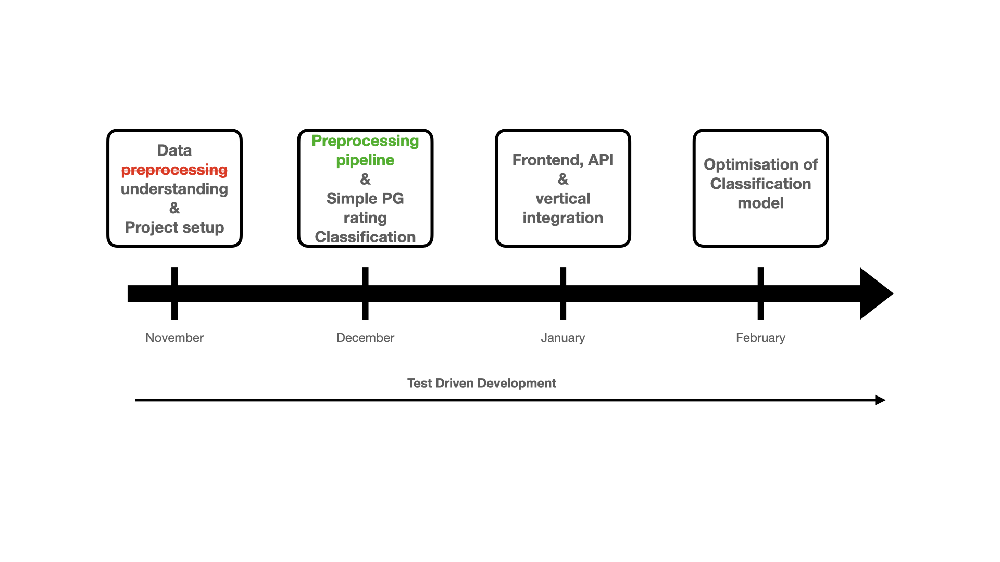

# Age Restriction Analysis of Movie Scripts
The goal of our project is to automate and extend the age rating of movies based on the script of the movie. The criteria for our evaluation will be primarily based on the official rating rules used by the [Motion Picture Association](https://www.filmratings.com/RatingsGuide).

## 1. General information
### Team Members:
- Jakob Hennighausen
  - Email: jakob.hennighausen@stud.uni-heidelberg.de
- Davit Melkonyan
  - Email: davit.melkonyan@stud.uni-heidelberg.de
- Leon Remke
  - Email: leon.remke@stud.uni-heidelberg.de
### Existing code fragments

### Utilized libraries
- Elastic search
- React
- Fastapi
- Spacy
Check requirements.txt in sub-modules of project for detailed information.

### Contributions
See "Project log" section.

## 2. Project State

### Planning State
One of our high level milestones for November could not be achivet yet. Find a detailed list of goals achived and not achived.
#### Achived Goals
- Basic project setup
- Setup elastic search hosting on linux server
- Data crawling
- Data understanding
- Data analysis
- Start of data preprocessing
- Get baseline for PG-Ratings
#### Open Goals
- Data preprocessing pipeline
- Decision which statistical method to use for age ratings
- First PG ratings on films
### Future Planning

Currently, the project is behind schedule with respect to the initial milestone plan. This should be made up by the lecture break from 22.12.22 to 07.01.23.
One reason for the delay is the change in data sourcing. The operator of a platform for film scripts had unexpectedly stopped responding.
### High-level Architecture Description
#### High level application architecture

#### High level processing architecture
todo: add descriptions to preprocessing steps and knowledge from data analysis

### Experiments
First experiment to find the official age ratings of movies through a TMDB API. For this we wrote a python script and used a selection of movie titles to get the age ratings. Results can be found [here](data_exploration/baseline/data/map_title_to_ageRating.txt)

Data analysis, explocation and description. Results can be found in next section.
## 3. Data Analysis
This section can be found in this jupyter-notebook: 
## Project log
### 10.11. - 12.12.22
#### Davit
- POC dataset crawling
- Linux server for elasticsearch instance
- Data understanding and preprocessing
#### Jakob
- Research papers and materials
- Research for baseline dataset
- Implementation of finding age ratings by movie titles with [TMDB API](https://www.themoviedb.org/documentation/api)
#### Leon
- Setup git project (react, fastapi, elasticsearch, dockerfiles)
- Setup git-hooks integration
- Run elasticsearch instance on linux server

### January

Agile reiteration of the project. More research on the topic -> new and better structured Datasets -> more alternative Strategies and better data preprocessing.

### February

- Ready UI
- Solved Server issues
- Working on the models
- Refining the preprocessing pipline

## Frontend

https://user-images.githubusercontent.com/106511982/222763210-ce06bc0d-3d9c-4900-8ea7-ff128f1a6ead.mov

